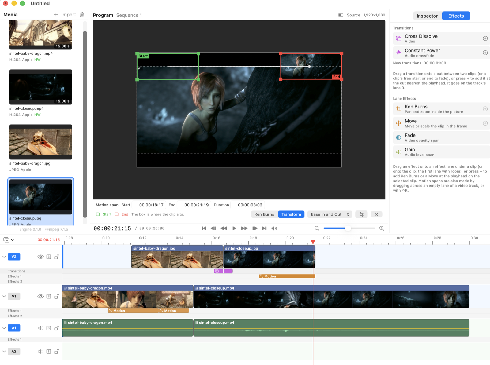
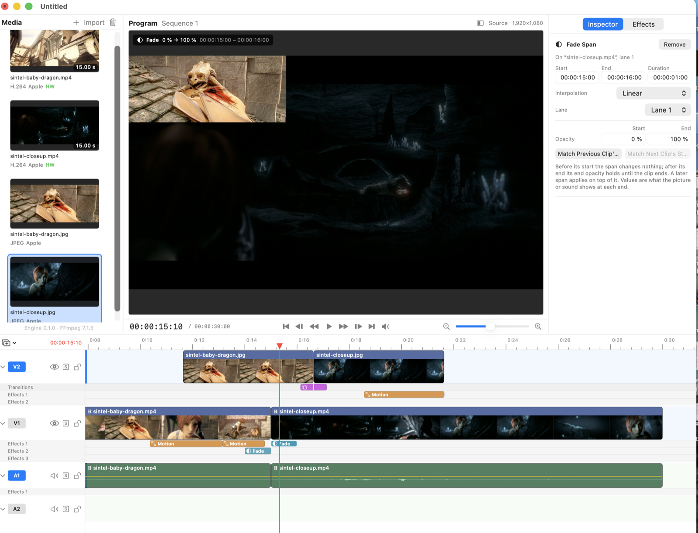

# Framewright


Framewright is a native macOS video editor in the spirit of a simple Premiere: import
footage, arrange clips on a multi-track timeline, trim, split and move them, dissolve between
them, adjust motion and sound in an inspector, play it back with synced audio, and export.
It runs on Apple silicon and uses the hardware wherever there is hardware to use.

<p>

</p>
<p>

</p>

Screenshots use footage from [Sintel](https://durian.blender.org) (Blender Foundation, CC BY 3.0).

**This codebase is entirely AI-written.** Every line of engine code, UI, build script, test
and document was produced by Claude Code: Claude Fable 5.1 acting as the lead (planning,
review, verification) directing Claude Opus 5.5 subagents that implemented each phase, with a
human owner steering by hand-testing the app and reviewing the reports. Treat it accordingly:
the test suite is large and every phase was adversarially reviewed and fixed, but no human has
audited the code line by line.

## What it does today

- Import MP4, MOV, MKV, WebM, ProRes, AV1, stills and audio; a router picks Apple's
  AVFoundation/VideoToolbox path when it can decode the file in hardware and an FFmpeg path
  (with the VideoToolbox hwaccel) otherwise. Both backends pass one conformance suite.
- Multi-track timeline with move, trim, split, ripple, linked audio/video, snapping, marquee,
  undo/redo of every edit, and exact rational time math (29.97 fps and 44.1 kHz audio do not
  accumulate rounding).
- Real-time playback with an audio-clocked Metal compositor, JKL shuttle, frame stepping and
  scrubbing; measured A/V offset on the real output device is zero within a sample. A still
  playhead keeps a short lookahead decoded and the audio primed, so Space starts within a frame
  (about 20-30 ms press to picture on cached media, variable-frame-rate phone footage included).
  The audio output stays on for 5 minutes after the last transport action (1 minute on battery).
- A window laid out for the program monitor: the source monitor appears beside it when media is
  opened (View > Show Source Monitor, Shift+Cmd+2), the timeline is as tall as its tracks (empty
  tracks collapse), the dividers can be dragged and are remembered, and the inspector has an
  Effects tab with the transitions (drag onto a cut, or "+" at the playhead) and the lane
  effects. View > Program Monitor on Second Display shows the program full screen on another
  display, mirrored and in sync with the in-window monitor.
- Effect lanes: under each track its lanes hold spans. Lane 0 has the transitions (cross dissolves and
  constant-power crossfades across a cut, with any split of the two sides such as 70/30, and fades to and from
  black or silence); lanes 1-3 have Motion, Fade (opacity) and Gain spans, each with start and end values that
  compose onto the clip's own (a pan on one lane, a zoom on another) and hold their end value until the clip ends.
  Drag across an empty lane to make a span (a Motion span on video, with Option a fade, a Gain span on audio), or
  press Control-K for a Motion span at the playhead; drag a span to move it and its edges to trim it (snapping to
  the playhead, the cuts and the other spans; one undo step each); drag a transition's edges to change each side
  of its cut (a dissolve pulled back to its clip's end becomes a fade out). The Effects tab's transitions drop on a
  cut or a clip's free start or end, its Ken Burns, Move, Fade and Gain effects on a lane. The inspector shows a
  span's range and the values its start and end show on screen, editable, and a transition's share of each side of
  the cut. A track header's disclosure hides its lanes. Selecting a Motion span opens its editor over the program
  monitor in one of two modes that set the same values, switched on its bar: Ken Burns shows the clip alone and
  unplaced, and its green start and red end rectangles are the part of the picture that fills the frame (shrink
  one to zoom in); Transform shows the program, and its boxes are where the clip sits (a picture in picture moves
  and zooms where it is). Every drag edits the span live (one undo step per drag), with smoothing, swap and
  continuing a touching clip's framing; Ken Burns and Move in the Effects tab or the Clip menu open in their mode,
  Control-K in Ken Burns mode when the clip spans the frame across or down (a letterboxed or pillarboxed picture
  too). The monitors shade the area around the frame so its edge shows. Projects from earlier versions open with their keyframes and fades as spans and look and sound the
  same.
- Inspector for the clips' position, scale, rotation, opacity, gain, fades and exact speed; transitions
  kept together with their linked partner (Delete removes both, Option-Delete one; a change also changes
  the linked one unless turned off); a note when a dissolve sits on a plain split (both sides show the
  same frames); the gain line on audio clips; Speed/Duration sheet.
- Photos: drag photos and videos from Photos.app onto the media bin or the timeline (file promises
  received into a Media folder the app makes next to the project, or inside a folder you choose,
  with progress and cancel; iCloud originals can take their time), or File > Import from Photos…
  (the system photo picker). HEIC photos import as stills, HEVC and slow-motion clips as video,
  Live Photos as the part you choose (Settings > Media > Live Photos: ask, or always the video or
  the still). Media that arrives after you edited the timeline stays in the bin instead of being
  placed over your edits; quitting or opening another project while media arrives asks first.
- Project files in JSON with schema migration; security-scoped bookmarks for media.
- Export (File > Export…): H.264, HEVC (8-bit and 10-bit Main10) and ProRes 422 on
  VideoToolbox (hardware where the Mac has it for the frame size) and software AV1 (SVT-AV1) to
  MP4, MOV or MKV, with AAC or PCM audio, rendered by the same scheduler, compositor and mixer as
  playback; progress, cancel and a hardware/software answer per format. The movie is written to a
  temporary file and moved into place only when complete, so cancelling (or a failure, or a full
  disk) never touches a file you chose to replace. Changing the container after choosing a file
  asks for the file again; playback waits while an export runs.

## Architecture

- `Engine/` is an Objective-C++ framework (`FramewrightEngine`, the code name): a plain C++ model
  and edit engine (`Model`, `Edit`, `Serialize`), media backends behind one interface
  (`Media/Apple`, `Media/FFmpeg`, a router, a frame cache and a decode pool), a Metal compositor
  and preview view (`Render`), a lock-free audio mixer and playback controller (`Audio`,
  `Playback`), and an Objective-C facade for Swift (`Facade`).
- `App/` is SwiftUI with AppKit where SwiftUI is weak (the timeline canvas, numeric fields,
  window and keyboard handling).
- `docs/reviews/` holds the review process: every phase gets an adversarial read-only review,
  the findings are fixed in a follow-up round, and the open list is kept current.
- See [PLAN.md](PLAN.md) for the original design and roadmap.
- Framewright was developed under the code name VidEdit; the `VE` class prefix and the `ve`
  C++ namespace in the engine come from that and are kept as internal names.

Requirements: macOS 14+ on Apple silicon, Xcode 26 (with its Metal Toolchain
component), Homebrew.

## Build

```sh
# 1. Tools (once)
brew install xcodegen
xcodebuild -downloadComponent MetalToolchain   # once per Xcode install; needed to compile .metal files

# 2. FFmpeg 7.1.5, LGPL-only, arm64 dylibs into ThirdParty/ffmpeg/ (a few minutes; skipped if already built)
Scripts/build-ffmpeg.sh            # add --force to rebuild from scratch
#    Options (environment): BUILD_TOOLS=1 (default) also builds the static ffmpeg/ffprobe tools the
#    tests use to write MKV/WebM/Opus/AV1... test media (BUILD_TOOLS=0 skips them; those tests
#    then report XCTSkip); ENABLE_SVTAV1=1 (default) links the SVT-AV1 encoder into libavcodec
#    (ENABLE_SVTAV1=0 builds without AV1 encoding; AV1 decoding through dav1d is unaffected).

# 3. Generate Framewright.xcodeproj from project.yml (FFmpeg must be built first)
xcodegen generate

# 4. Build the app
xcodebuild -scheme Framewright -configuration Debug -destination 'platform=macOS' build

# 5. Run all tests (EngineTests + AppTests)
xcodebuild -scheme Framewright -destination 'platform=macOS' test

# Engine tests only
xcodebuild -scheme EngineTests -destination 'platform=macOS' test
```

Re-run `xcodegen generate` after adding, removing or renaming files, and after
rebuilding FFmpeg. The `.xcodeproj` is generated and not checked in; `project.yml`
is the source of truth.

The build treats warnings as errors (`-Wall -Wextra` for C/Objective-C/C++,
`SWIFT_TREAT_WARNINGS_AS_ERRORS` for Swift).

## Signing

- **Debug** (what `build`/`test` above use) and **Release** are signed ad hoc
  (`CODE_SIGN_IDENTITY=-`) without the hardened runtime, so they build, test and launch
  headless with no developer account.
- **Distribution** (used by Archive) is Release plus the hardened runtime and a real identity,
  as notarized distribution outside the App Store requires. It defaults to
  `Developer ID Application`; set your team (and, if you like, another identity) in
  `Config/Signing.local.xcconfig` (gitignored; read by `Config/Distribution.xcconfig`):

  ```
  FRAMEWRIGHT_CODE_SIGN_IDENTITY = Developer ID Application
  FRAMEWRIGHT_DEVELOPMENT_TEAM = ABCDE12345
  ```

  or pass them on the command line:

  ```sh
  xcodebuild -scheme Framewright -configuration Distribution -destination 'platform=macOS' \
      FRAMEWRIGHT_DEVELOPMENT_TEAM=ABCDE12345 build
  xcodebuild -scheme Framewright -archivePath build/Framewright.xcarchive \
      FRAMEWRIGHT_DEVELOPMENT_TEAM=ABCDE12345 archive
  ```

  The hardened runtime enables library validation, which loads only embedded code signed with
  the app's Team ID: the build re-signs FramewrightEngine.framework and the FFmpeg dylibs with the
  app's identity when it copies them into `Contents/Frameworks` (CodeSignOnCopy), so they load,
  and the archive can be exported with Developer ID from the Organizer (which adds the secure
  timestamp) and notarized. An ad hoc build with the hardened runtime would abort at launch
  (dyld: "different Team IDs"), which is why Debug and Release keep it off.

The app runs with the App Sandbox enabled in every configuration.

## Open in Xcode

```sh
xcodegen generate && open Framewright.xcodeproj
```

Pick the **Framewright** scheme and press Run (Cmd+R) or Test (Cmd+U).

## Layout

- `Engine/`: `FramewrightEngine.framework`, Objective-C++ (C++20, ARC). Public API lives
  in `Engine/Facade/` (umbrella header `FramewrightEngine.h`); everything else is
  project-private. Metal shaders compile into the framework's `default.metallib`.
- `EngineTests/`: XCTest bundle (Objective-C++). Plain C++ tests use doctest
  `TEST_CASE`s in any `.cpp`/`.mm` file in this folder; they all run inside the
  `DoctestRunnerTests` XCTest.
- `App/`: the SwiftUI app. `AppTests/`: Swift tests hosted in the app.
- `ThirdParty/`: vendored `json.hpp` and `doctest.h` (see `ThirdParty/VERSIONS.md`)
  and the FFmpeg build output (`ffmpeg/`, not checked in).
- `Scripts/`: `build-ffmpeg.sh` (FFmpeg, see above), `make_test_media.swift` (writes the
  burn-in test media; EngineTests run it themselves and cache the output), `format.sh`.
- `Config/`: `Distribution.xcconfig` (identity and team of the Distribution configuration, see
  Signing).

## Formatting

```sh
brew install clang-format swiftformat   # optional
Scripts/format.sh           # format in place
Scripts/format.sh --check   # lint only
```

## FFmpeg and licensing

FFmpeg 7.1.5 is licensed under the GNU LGPL 2.1 or later. Framewright builds it with
`--disable-gpl --disable-nonfree` (the build script fails if `config.h` says otherwise) and
ships it as separate, unmodified dylibs in `Framewright.app/Contents/Frameworks`, loaded through
`@rpath`, so users can replace them with their own build as the LGPL requires (re-sign the
bundle afterwards). dav1d (BSD-2-Clause) and SVT-AV1 (BSD-3-Clause-Clear plus the AOMedia
patent licence) are linked statically into libavcodec.

- The complete licence texts and notices ship in the app (`Contents/Resources/Acknowledgements.md`
  and `COPYING.LGPLv2.1`) and are shown by **Framewright > Acknowledgements…**; their sources are
  `App/Resources/`.
- Source offer: the FFmpeg libraries are built from the unmodified release tarball
  https://ffmpeg.org/releases/ffmpeg-7.1.5.tar.xz (SHA-256 in `ThirdParty/VERSIONS.md`) by
  `Scripts/build-ffmpeg.sh`, which pins every version and checksum and records the exact
  configure flags; running it reproduces the shipped libraries. The author provides the
  complete corresponding source (tarballs and build script) of the FFmpeg libraries shipped with
  any Framewright release on request, for at least three years after that release.
- nlohmann/json and doctest are MIT-licensed (doctest is used only to build the tests).

## License

Framewright is free software: you can redistribute it and/or modify it under the terms of the
GNU General Public License as published by the Free Software Foundation, either version 3 of
the License, or (at your option) any later version. See [LICENSE](LICENSE). It is distributed
without any warranty; see the license for details.

Third-party components keep their own licenses (FFmpeg LGPL 2.1+, dav1d BSD-2, SVT-AV1
BSD-3-Clear with the AOMedia patent license, nlohmann/json and doctest MIT), all compatible
with GPL-3.0; the texts ship in the app and are listed in `App/Resources/Acknowledgements.md`.
